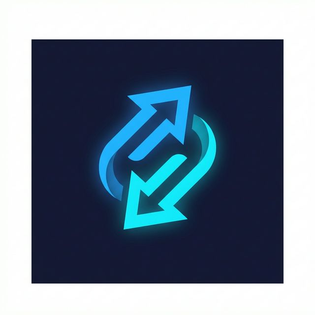

<p align="center">
  
</p>

<h1 align="center">BiDirection</h1>

<p align="center">
  <strong>Terminal ↔ IDE Bidirectional Communication Bridge</strong>
</p>

<p align="center">
  <a href="#quick-start">Quick Start</a> •
  <a href="#features">Features</a> •
  <a href="#command-reference">Commands</a> •
  <a href="#architecture">Architecture</a> •
  <a href="#api-reference">API</a> •
  <a href="#contributing">Contributing</a>
</p>

<p align="center">
  
  
  
  
  
</p>

---

BiDirection creates a **real-time communication channel** between your external terminal and your IDE. Read files, apply edits, get diagnostics, control AI agents, inspect knowledge bases — all from iTerm2, Alacritty, or any terminal emulator.

Built for **VS Code** and **Antigravity** with deep integration into Antigravity's brain, knowledge, workflows, skills, MCP servers, code tracker, and cockpit systems.

## Quick Start

### Option 1: One-Command Setup

```bash
curl -fsSL https://raw.githubusercontent.com/dmdat/bidirection/main/scripts/install.sh | bash
```

### Option 2: Manual Setup

```bash
# 1. Clone & build
git clone https://github.com/dmdat/bidirection.git
cd bidirection
npm install && npm run build

# 2. Install CLI globally
cd packages/cli && npm link

# 3. Install VS Code extension
cd ../vscode-extension && npm run package
code --install-extension bidirection-bridge-1.0.0.vsix

# 4. Verify
bidirection ping    # → pong
```

The extension **auto-starts** on VS Code launch — look for `$(plug) BiDirection` in the status bar.

## Features

### 🔌 3-Tier Architecture

| Tier | Method | Requires Extension? | Capabilities |
|------|--------|---------------------|--------------|
| **1** | Socket Discovery | No | Find VS Code IPC sockets, inject `VSCODE_IPC_HOOK_CLI` |
| **2** | Bridge Server | Yes | Full JSON-RPC 2.0: read/write/edit/diagnostics/commands |
| **3** | OS Fallback | No | AppleScript keystrokes, URL schemes, accessibility APIs |

### 🤖 Antigravity Deep Integration

| Feature | Commands | What It Does |
|---------|----------|-------------|
| **Agent** | 12 cmds | Send prompts, @mentions, mode switching, templates |
| **Brain** | 5 cmds | Inspect conversation artifacts, task checklists, logs |
| **Knowledge** | 3 cmds | Browse & search knowledge items |
| **Workflows** | 4 cmds | List, show, run, create agent workflows |
| **Skills** | 2 cmds | Browse SKILL.md files |
| **MCP** | 4 cmds | Manage MCP server configuration |
| **Tracker** | 3 cmds | Inspect agent-edited file snapshots |
| **Conversations** | 2 cmds | Browse conversation data & recordings |
| **Cockpit** | 3 cmds | Control the Antigravity Cockpit extension |
| **System** | 3 cmds | System info, browser allowlist management |

## Command Reference

### Bridge Commands

```bash
bidirection ping                              # Test connection
bidirection info                              # Bridge server metadata
bidirection discover                          # Find IDE sockets
bidirection inject                            # Export VSCODE_IPC_HOOK_CLI
```

### Editor

```bash
bidirection read                              # Active editor content
bidirection read --selection                  # Selected text only
bidirection read --json                       # Output as JSON
bidirection open src/main.ts --line 42        # Open file at line
bidirection edit src/main.ts --start-line 9 --text "new code"
bidirection highlight src/main.ts 10 --end-line 20
```

### Workspace

```bash
bidirection diagnostics                       # All errors/warnings
bidirection diag src/main.ts                  # File-specific diagnostics
bidirection files                             # List open editors
bidirection exec editor.action.formatDocument # Run any VS Code command
bidirection message "Done!" --type info       # Show notification
bidirection watch                             # Stream editor events
```

### OS-Level (No Extension Required)

```bash
bidirection os open src/main.ts --line 15     # URL scheme
bidirection os keystroke "s" --modifier command --app Code
bidirection os activate "Code"                # Bring IDE to front
bidirection os ui-tree "Antigravity"          # Accessibility tree
```

### Agent Panel

```bash
bidirection agent send "Fix the login bug"                # Basic prompt
bidirection agent send "Review this" -@ src/auth.ts       # With @mentions
bidirection agent send --type "short prompt"              # Keystroke mode
bidirection agent mode planning "Design the auth system"  # Mode framing
bidirection agent mode deep "Analyze architecture"        # Deep reasoning
bidirection agent diff HEAD~3                             # Git diff → review
bidirection agent commit                                  # Commit message
bidirection agent review src/main.ts                      # Code review
bidirection agent explain src/main.ts                     # Explain code
bidirection agent test src/main.ts                        # Generate tests
bidirection agent debug --stdin                           # Pipe errors
bidirection agent read                                    # Read response
bidirection agent detect                                  # Running IDEs
bidirection agent templates                               # List templates
```

**Mode options:** `planning`, `fast`, `deep`, `verify`

### Brain Inspector

```bash
bidirection brain list -n 5                   # Recent conversations
bidirection brain show [id]                   # Artifact details
bidirection brain task [id]                   # Task checklist (colorized)
bidirection brain logs [id]                   # System-generated logs
bidirection brain read [id] walkthrough.md    # Read artifact content
```

### Knowledge Base

```bash
bidirection ki list                           # All knowledge items
bidirection ki show <id>                      # View details (fuzzy match)
bidirection ki search "Priority Engine"       # Search across all artifacts
```

### Workflows

```bash
bidirection wf list                           # Project workflows
bidirection wf show deploy                    # View workflow steps
bidirection wf run deploy                     # Send /deploy to agent
bidirection wf create test-all "Run tests"    # Create workflow file
```

### Skills

```bash
bidirection skill list                        # Browse project skills
bidirection skill show my-skill               # Read SKILL.md content
```

### MCP Servers

```bash
bidirection mcp list                          # Configured servers
bidirection mcp show perplexity-ask           # Details (masked keys)
bidirection mcp add fetch-mcp npx -y fetch-mcp
bidirection mcp remove fetch-mcp
```

### Code Tracker

```bash
bidirection tracker list                      # Tracked projects
bidirection tracker files BiDirection         # Agent-edited snapshots
bidirection tracker diff agent.ts             # Diff snapshot vs workspace
```

### Conversations

```bash
bidirection conv list -n 10                   # Recent (🧠📹 indicators)
bidirection conv recordings [id]              # Browser recording files
```

### Cockpit

```bash
bidirection cockpit open                      # Open cockpit (Ctrl+Shift+Q)
bidirection cockpit refresh                   # Refresh quota data
bidirection cockpit logs                      # Show cockpit logs
```

### System

```bash
bidirection system info                       # Full Antigravity dashboard
bidirection system browser-allow example.com  # Add to allowlist
bidirection system browser-deny example.com   # Remove from allowlist
```

**`system info` output:**
```
⚙️  Antigravity System Info
  Installation:  38c55001-...
  📊 Data: 34 conversations, 35 brain, 5 KIs, 17 tracked, 3 recordings
  💾 Storage: 214.3M total
  🔌 MCP: perplexity-ask
  🧩 Extensions: 20 installed
  🌐 Browser Allowlist: (empty)
```

## Architecture

```
                            ┌─────────────────────────────────────────────┐
                            │              VS Code / Antigravity          │
                            │                                             │
 ┌──────────────────┐       │  ┌──────────────────────────────────────┐   │
 │                  │       │  │       BiDirection Extension          │   │
 │  External        │  Unix │  │                                      │   │
 │  Terminal        │ Domain│  │  ┌────────────┐  ┌───────────────┐   │   │
 │                  │ Socket│  │  │   Server    │  │   Handlers    │   │   │
 │  bidirection CLI │◀═════▶│  │  │ JSON-RPC   │  │  • Editor     │   │   │
 │  (41 commands)   │       │  │  │ 2.0        │──│  • Workspace  │   │   │
 │                  │       │  │  │            │  │  • Terminal   │   │   │
 │  bd (alias)      │       │  │  └────────────┘  │  • Window     │   │   │
 │                  │       │  │                   └───────────────┘   │   │
 └──────────────────┘       │  └──────────────────────────────────────┘   │
                            └─────────────────────────────────────────────┘

 ┌──────────────────────────────────────────────────────────────────────┐
 │                    ~/.gemini/antigravity/                            │
 │                                                                      │
 │  brain/          → Conversation artifacts, task.md, plans, logs     │
 │  knowledge/      → Distilled knowledge items with artifacts         │
 │  conversations/  → Raw conversation data (.pb)                      │
 │  code_tracker/   → Agent-edited file snapshots per project          │
 │  mcp_config.json → MCP server configuration                        │
 │  browser_recordings/ → Per-conversation browser captures            │
 │  implicit/       → Protobuf implicit context files                  │
 │  annotations/    → Per-conversation annotations (.pbtxt)            │
 └──────────────────────────────────────────────────────────────────────┘
```

### Package Structure

```
bidirection/
├── packages/
│   ├── core/                   # Shared protocol + utilities
│   │   ├── src/
│   │   │   ├── protocol.ts     # JSON-RPC 2.0 types & methods
│   │   │   ├── client.ts       # Bridge client (socket connection)
│   │   │   ├── framing.ts      # 4-byte length-prefixed message framing
│   │   │   ├── antigravity.ts  # Brain, knowledge, conversation utilities
│   │   │   ├── workflows.ts    # Workflow/skill discovery & parsing
│   │   │   └── index.ts        # Public API exports
│   │   └── package.json
│   │
│   ├── cli/                    # Terminal client (41 commands)
│   │   ├── src/
│   │   │   ├── index.ts        # Entry point, command registration
│   │   │   └── commands/
│   │   │       ├── agent.ts        # AI agent panel (12 cmds)
│   │   │       ├── brain.ts        # Brain inspector (5 cmds)
│   │   │       ├── knowledge.ts    # Knowledge browser (3 cmds)
│   │   │       ├── workflow.ts     # Workflow manager (4 cmds)
│   │   │       ├── skill.ts        # Skill browser (2 cmds)
│   │   │       ├── mcp.ts          # MCP server config (4 cmds)
│   │   │       ├── tracker.ts      # Code tracker (3 cmds)
│   │   │       ├── conversation.ts # Conversation data (2 cmds)
│   │   │       ├── cockpit.ts      # Cockpit proxy (3 cmds)
│   │   │       ├── system.ts       # System info (3 cmds)
│   │   │       ├── bridge.ts       # Bridge commands (11 cmds)
│   │   │       ├── os-fallback.ts  # OS-level commands (4 cmds)
│   │   │       └── discover.ts     # Socket discovery (1 cmd)
│   │   └── package.json
│   │
│   └── vscode-extension/       # VS Code extension
│       ├── src/
│       │   ├── extension.ts    # Activation, commands, status bar
│       │   ├── server.ts       # Unix Domain Socket server
│       │   └── handlers/       # JSON-RPC method handlers
│       │       ├── editor.ts
│       │       ├── workspace.ts
│       │       ├── terminal.ts
│       │       └── window.ts
│       ├── images/icon.png     # 128×128 marketplace icon
│       └── package.json
│
├── scripts/
│   ├── test-e2e.js             # End-to-end integration tests
│   └── install.sh              # One-command installer
│
└── package.json                # Root workspace config
```

## API Reference

### Protocol

All communication uses **JSON-RPC 2.0** over Unix Domain Socket with **4-byte length-prefixed** message framing.

**Socket location:** `~/.bidirection/bridge.sock`

### Request Format

```json
{
  "jsonrpc": "2.0",
  "id": 1,
  "method": "editor/getText",
  "params": {}
}
```

### Response Format

```json
{
  "jsonrpc": "2.0",
  "id": 1,
  "result": {
    "text": "const x = 42;",
    "uri": "/path/to/file.ts",
    "languageId": "typescript"
  }
}
```

### Methods

| Method | Direction | Description |
|--------|-----------|-------------|
| `editor/getText` | CLI → IDE | Get active editor text |
| `editor/getSelection` | CLI → IDE | Get selected text + range |
| `editor/setCursor` | CLI → IDE | Move cursor to line/column |
| `editor/applyEdit` | CLI → IDE | Apply text edit to file |
| `editor/highlight` | CLI → IDE | Highlight line range |
| `workspace/openFile` | CLI → IDE | Open file in editor |
| `workspace/getDiagnostics` | CLI → IDE | Get errors/warnings |
| `workspace/getOpenFiles` | CLI → IDE | List open editor tabs |
| `terminal/create` | CLI → IDE | Create integrated terminal |
| `terminal/send` | CLI → IDE | Send text to terminal |
| `window/showMessage` | CLI → IDE | Show notification |
| `window/showInputBox` | CLI → IDE | Prompt for input |
| `command/execute` | CLI → IDE | Execute any VS Code command |
| `ping` | CLI → IDE | Health check |
| `getInfo` | CLI → IDE | Bridge server metadata |

### Error Codes

| Code | Name | Description |
|------|------|-------------|
| `-32700` | Parse Error | Invalid JSON |
| `-32600` | Invalid Request | Missing required fields |
| `-32601` | Method Not Found | Unknown method |
| `-32602` | Invalid Params | Wrong parameter types |
| `-32603` | Internal Error | Server-side failure |

## Configuration

### Extension Settings

| Setting | Type | Default | Description |
|---------|------|---------|-------------|
| `bidirection.autoStart` | `boolean` | `true` | Auto-start bridge on VS Code launch |
| `bidirection.socketPath` | `string` | `""` | Custom socket path (default: `~/.bidirection/bridge.sock`) |

### CLI Global Options

| Flag | Description |
|------|-------------|
| `-s, --socket <path>` | Custom bridge socket path |
| `--json` | Output as JSON (where supported) |
| `--dry-run` | Preview action without executing |
| `-a, --app <name>` | Target IDE app name (default: Antigravity) |

## Requirements

| Dependency | Minimum Version |
|-----------|----------------|
| **Node.js** | 18+ |
| **VS Code** or **Antigravity** | 1.85+ |
| **macOS** | Required for Tier 3 OS commands and agent panel |
| **Linux / WSL** | Tier 1 + Tier 2 fully supported |

### macOS Permissions

For agent panel commands (`agent send`, `cockpit open`, etc.), grant **Accessibility** permission:  
System Preferences → Privacy & Security → Accessibility → enable your Terminal app.

## Contributing

### Development Setup

```bash
git clone https://github.com/dmdat/bidirection.git
cd bidirection
npm install
```

### Build

```bash
npm run build              # Build all packages
npm run build:core         # Core only
npm run build:cli          # CLI only
npm run build:ext          # Extension only (esbuild)
```

### Watch Mode

```bash
npm run dev                # Watch CLI
npm run dev -w packages/vscode-extension  # Watch extension
```

### Test

```bash
node scripts/test-e2e.js   # 31 end-to-end integration tests
```

### Package Extension

```bash
cd packages/vscode-extension
npm run package            # → bidirection-bridge-1.0.0.vsix (30KB)
```

### Adding a New CLI Command

1. Create `packages/cli/src/commands/your-command.ts`
2. Export `registerYourCommands(program: Command): void`
3. Import and register in `packages/cli/src/index.ts`
4. Build: `npm run build:cli`

### Adding a New JSON-RPC Method

1. Add method constant to `packages/core/src/protocol.ts`
2. Add handler in `packages/vscode-extension/src/handlers/`
3. Register handler in `extension.ts`
4. Add CLI command in `packages/cli/src/commands/bridge.ts`

## License

[MIT](LICENSE) © dmdat
